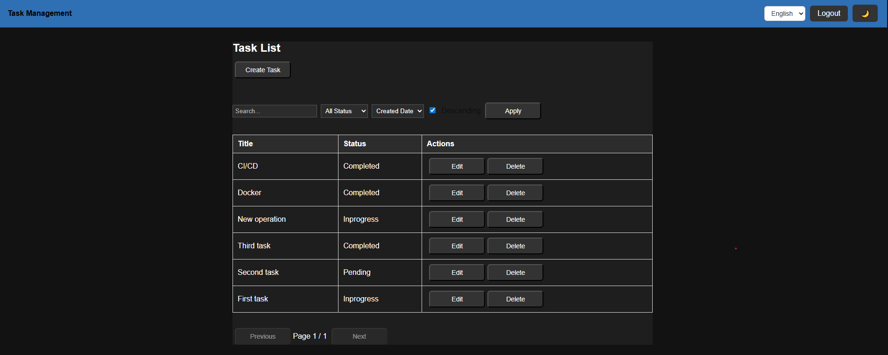

## Task Management System

---


A production-ready Task Management REST API built with ASP.NET Core 8, Entity Framework Core, SQL Server, Docker, and deployed on Azure Container Apps.

---

# Live DEMO

Swagger Documentation:

https://task-api-container.livelywave-91602587.francecentral.azurecontainerapps.io/swagger

Health Check

https://task-api-container.livelywave-91602587.francecentral.azurecontainerapps.io/

Root Endpoint:

GET /

Returns:

{ "message": "Task Management API OK", "version": "1.0", "documentation": "/swagger", "health": "/api/health" }

Frontend:

https://task-frontend-container.livelywave-91602587.francecentral.azurecontainerapps.io

---

# Features

JWT Authentication & Authorization

User Registration & Login

Task CRUD Operations

Role-based architecture

Entity Framework Core + SQL Server

Dockerized backend service

Azure Container Apps deployment

GitHub Actions CI/CD ready

Production environment configuration

---

# Architecture

```text
┌──────────────────────┐
│   Angular Frontend   │
│  Azure Container App │
└──────────┬───────────┘
           │ HTTP API
           ▼
┌──────────────────────┐
│  ASP.NET Core API    │
│ Azure Container App  │
└──────────┬───────────┘
           │
           ▼
┌──────────────────────┐
│      SQL Server      │
│      Azure SQL       │
└──────────────────────┘
```

---

# Screenshots

Login Page


### Dashboard



### Swagger API


---

# Tech Stack

ASP.NET Core (.NET 8)

Entity Framework Core

SQL Server

JWT Authentication

Docker

Docker Compose

Azure Container Apps

Azure SQL Database

Github Actions

---

# Project Structure

```text
TaskManagementSystem.API
├── Common
├── Controllers
├── Data
├── DTOs
│   ├── Auth
│   └── Tasks
├── Enums
├── Extensions
├── Migrations
├── Models
├── Repositories
└── Services
```

---

# Default Admin User

Automatically created when the database is empty.

Username:

admin

Password:

123456

Role:

Admin

---

# Running Locally

Clone the repository:

git clone https://github.com/ThaiBangHOANG/task-management-system

Navigate to project:

cd task-management-system

Update connection string in appsettings.json.

Apply migrations:

dotnet ef database update

Run the application:

dotnet run

---

# Run with Docker

Build image

docker build -t task-api

Run container

docker run -p 5000:8080 task-api

---

# Docker Compose

This backend service is designed to work together with the Angular frontend using Docker Compose orchestration.

---

# Azure Deployment

The application is deployed using:

DockerHub container registry

Azure Container Apps

GitHub Actions CI/CD

---

# CI/CD

GitHub Actions automatically:

Build Docker image

Push image to DockerHub

Deploy latest image to Azure Container Apps

---

# Development branch Dev
All new features and bug fixes are merged into the Dev branch first. This branch is used for testing and staging before merging to main.

---

# Author
Thai Bang HOANG
